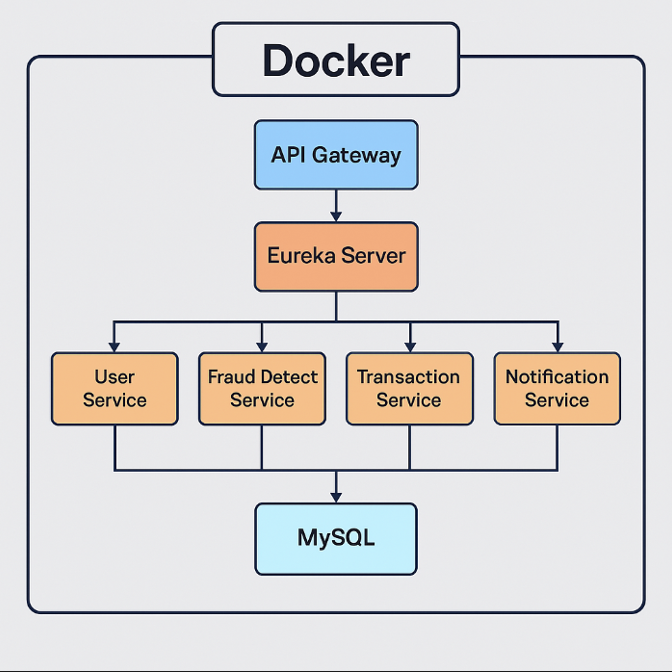
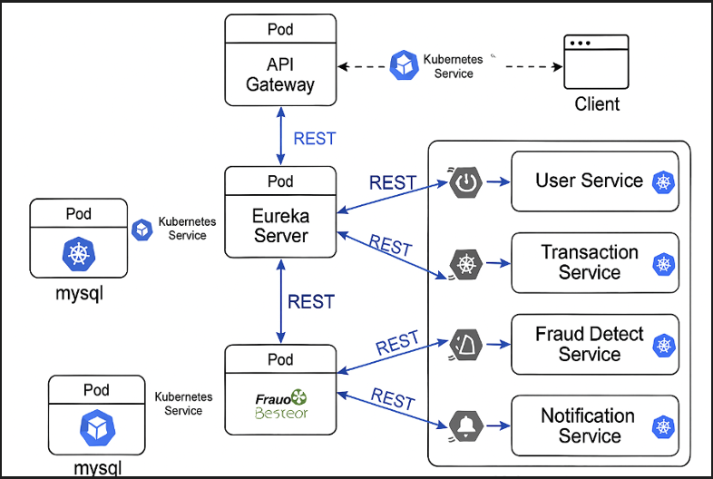

# Fraud Detection & User Management System

This project is a **Microservices-based Fraud Detection & User Management System** built using **Spring Boot Microservices** architecture. It includes several independent services that communicate with each other to manage users, detect fraud in transactions, notify users, and orchestrate everything through an **API Gateway** and **Service Discovery**.

---

## Technologies Used

1. **Spring Boot Microservices**
2. **Docker**
3. **Kubernetes**
4. **MySQL**
5. **Eureka**
6. **API Gateway**

---

## Workflow

1. **User Management Service**: 
   - Manages user information such as name, email, and phone number.
   - Registers new users, updates user information, and handles authentication.

2. **Transaction Service**: 
   - Handles transactions initiated by users.
   - Sends transaction data to the **Fraud Detection Service** for analysis.

3. **Fraud Detection Service**:
   - Analyzes transaction data for fraudulent patterns using predefined rules or machine learning algorithms.
   - Informs the **Notification Service** if fraud is detected.

4. **Notification Service**: 
   - Notifies users about potential fraud or successful transactions.

---

## Architecture

### Docker Compose Setup
The application is containerized using **Docker Compose**. This allows easy orchestration of multi-container services. The `docker-compose.yml` file defines all the services, networks, and databases.



---

### Communication and Kubernetics Deployment Diagram



---

### Steps to Run Locally:

1. Build and run the Docker containers:
   ```bash   
   docker-compose up --build

2. Check these server ports for Eureka-Server and Api-Gateway
   ```bash
   http://localhost:8761](http://localhost:8761
   http://localhost:3001](http://localhost:3001
